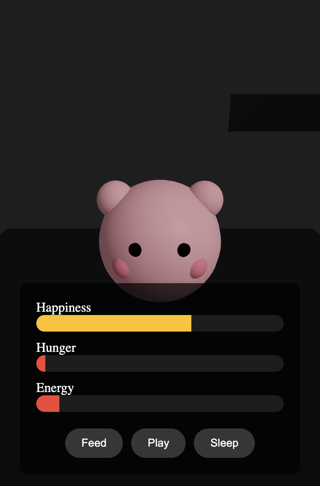

# Desktop Tamagotchi

A modern take on the classic Tamagotchi, built as a desktop application that lives on your screen. Features a cute 3D pet that you need to take care of, with real-time stats and interactions.



## Features

- 🖥️ Always-on-top desktop window
- 🎮 Draggable interface
- 🎨 Transparent background
- 🐱 3D animated pet
- 📊 Real-time stats tracking
- ✨ Interactive animations
- 🎯 Multiple interactions (Feed, Play, Sleep)

## Tech Stack

- React + TypeScript
- Three.js (3D graphics)
- React Three Fiber
- Electron (Desktop app)
- Emotion (Styling)

## Getting Started

### Prerequisites

- Node.js (v16 or higher)
- npm or yarn

### Installation

1. Clone the repository:
```bash
git clone <repository-url>
cd desktop-tamagotchi
```

2. Install dependencies:
```bash
npm install
```

### Development

1. Start the Vite development server:
```bash
npm run dev
```

2. In a new terminal, start the Electron app:
```bash
npm run electron:dev
```

### Building

To create a production build:
```bash
npm run electron:build
```

## How to Play

### Pet Care
- **Feed**: Increases hunger stat and slightly boosts happiness
- **Play**: Increases happiness but consumes energy
- **Sleep**: Recovers energy but decreases hunger

### Stats
- **Happiness**: Decreases over time, increased by playing
- **Hunger**: Decreases over time, replenished by feeding
- **Energy**: Decreases when playing, recovered by sleeping

### Pet Behavior
- Pet bounces more energetically when happy
- Blinking animation shows liveliness
- Body movements reflect energy levels
- Visual indicators show stat levels

## Development Notes

### Project Structure
```
├── electron/          # Electron main process
├── src/
│   ├── components/    # React components
│   ├── App.tsx        # Main React component
│   └── main.tsx      # React entry point
└── package.json
```

### Key Files
- `electron/main.cjs`: Electron main process
- `src/components/Scene.tsx`: 3D pet rendering
- `src/components/UI.tsx`: Stats and controls
- `src/App.tsx`: Main application component

## Contributing

1. Fork the repository
2. Create your feature branch (`git checkout -b feature/AmazingFeature`)
3. Commit your changes (`git commit -m 'Add some AmazingFeature'`)
4. Push to the branch (`git push origin feature/AmazingFeature`)
5. Open a Pull Request

## License

This project is licensed under the MIT License - see the [LICENSE](LICENSE) file for details.

## Acknowledgments

- Inspired by the classic Tamagotchi virtual pets
- Built with modern web technologies
- Uses Three.js for 3D graphics
- Electron for desktop integration 